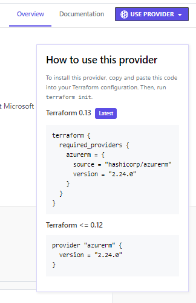
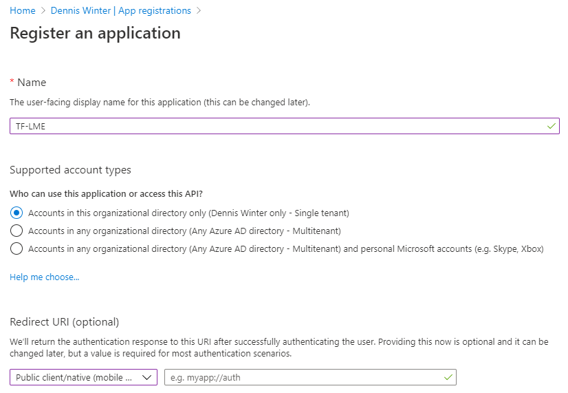
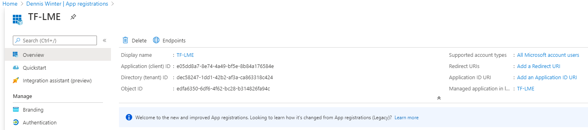
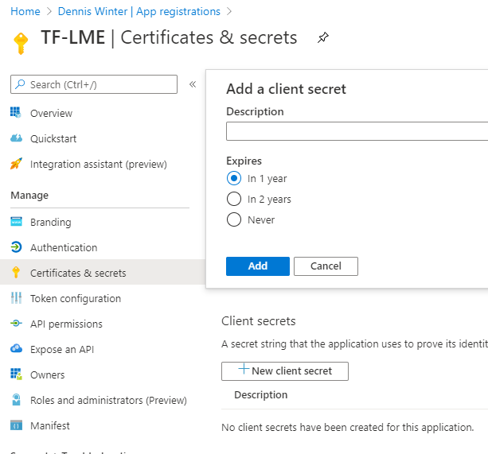
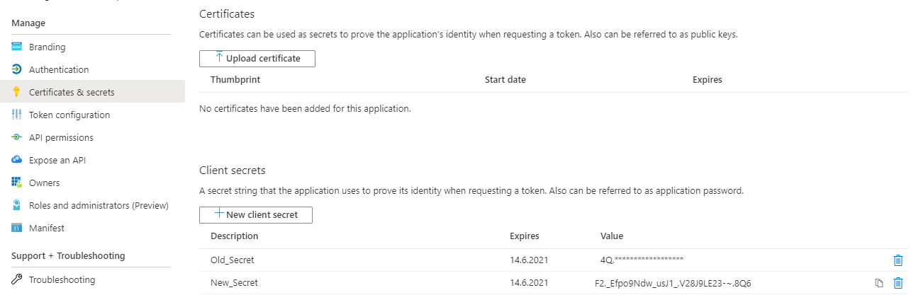
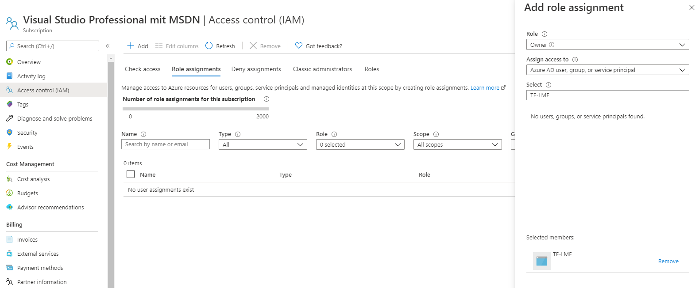

https://www.terraform.io/docs/backends/types/azurerm.html# Terraform-Training

<!-- toc -->

- [Terraform-Training](#terraform-training)
  - [Prerequisites](#prerequisites)
  - [What is Terraform?](#what-is-terraform)
  - [Terraform install](#terraform-install)
  - [Exercises](#exercises)
    - [Exercise Prep &nbsp; -- &nbsp; Setup Azure](#exercise-prep------setup-azure)
    - [Exercise 00 &nbsp; -- &nbsp; Structure of a Terraform root modules](#exercise-00------structure-of-a-terraform-root-modules)
    - [Exercise 01 &nbsp; -- &nbsp; Variables, Locals and Validation-Handling](#exercise-01------variables-locals-and-validation-handling)
    - [Exercise 02 &nbsp; -- &nbsp; Version-Upgrade](#exercise-02------version-upgrade)
    - [Exercise 03 &nbsp; -- &nbsp; Modules and Functions](#exercise-03------modules-and-functions)
    - [Exercise 04 &nbsp; -- &nbsp; For_Each, Count, Dynamic blocks, Generalized Splat Operator](#exercise-04------for_each-count-dynamic-blocks-generalized-splat-operator)
    - [Exercise 05 &nbsp; -- &nbsp; Workspace Usage; Local and Remote State](https://github.com/DenWin/Terraform-Training/blob/master/README.md#exercise-05------workspace-usage-local-and-remote-state)
- [APPENDIX](#appendix)
  - [Create a Service Principal](#create-a-service-principal)
    - [How to create a Service Principal](#how-to-create-a-service-principal)
    - [Client ID and Tenant ID](#client-id-and-tenant-id)
    - [How to create a Secret](#how-to-create-a-secret)
    - [An old and new Secret](#an-old-and-new-secret)
    - [IAM for Subscription](#iam-for-subscription)


<!-- tocstop -->

<br><br><br>

---
## Prerequisites

- An active Azure subscription (with administrator privileges and a [Service Principal](#create-service-principal) you have access to)
- [Visual Studio Code](https://code.visualstudio.com/download), plus:
  - [Terraform extension](https://marketplace.visualstudio.com/items?itemName=HashiCorp.terraform) (the current version 2.2.0 breaks the syntax, revert back to 2.1.1)
  - [Terraform snippets extension](https://marketplace.visualstudio.com/items?itemName=mindginative.terraform-snippets) (even though outdated, still nice to have)
- [Azure CLI](https://docs.microsoft.com/en-us/cli/azure/install-azure-cli-windows)
- [Git](https://git-scm.com/download/win) (optional)


<br><br><br>

---
## What is Terraform?

Well in its core Terraform is "just another" method to do Infrastructure as Code. Terraform is able to provision resources in Azure - or any other Cloud for that matter - just like Azure can do using ARM by its own.

**But it is also so much more than that!**

Beside it's core functionality as a "provisioning tool", Terraform holds a few more tricks up his sleeve:
### 1) Cross Platform <!-- omit in toc -->
As mentioned above, Terraform is capable to provision resources in all major cloud platforms and even a bunch of smaller ones.

Terraform is even able to provision certain PaaS- or SaaS-Services like [Kubernetes](https://registry.terraform.io/providers/hashicorp/kubernetes/latest/docs), [Databricks](https://github.com/databrickslabs/terraform-provider-databricks) or [Azure DevOps](https://cloudblogs.microsoft.com/opensource/2020/06/18/announcing-hashicorp-terraform-azure-devops-provider-release/).

Well, it is not that you can 100% reuse a configuration for Azure in AWS or vice versa. Each cloud provider requires it's own - let's call it - communication bridge: a so called Terraform provider. And each one of those provider has it's own set of resource-blocks to have Terraform do as one likes. But while the resource names and parameter differ according to their needs the syntax and logic structure may remain the same: [HashiCorp Language (HCL) Syntax](https://www.terraform.io/docs/configuration/syntax.html).

### 2) Language <!-- omit in toc -->
This brings up the next point, while e.g. ARM-Templates do have their own benefits, like it's written in JSON and you are able to provide an additional parameter and/ or variable file to reuse the template; but Terraform is able to do so as well - including JSON if you wish to.
Additionally HCL offers an easy approach to nested templates, conditional behavior. not to mention that ARM templates tend to become rather - in lack of a better word - clumsy.

### 3) Nesting Modules <!-- omit in toc -->
While it is possible to have [nested ARM Templates](https://docs.microsoft.com/en-us/azure/azure-resource-manager/templates/linked-templates) - I personally find the Terraform approach a lot more natural.

### 4) Validating you configuration  <!-- omit in toc -->
Validating your code before actually deploying it is an important point for all kind of deployments; let it be Terraform or ARM or whatever syntax you might use for any other cloud platform. But Terraform not only validates the code but gives you a dry run by default before you actually do anything! ARM Templates start doing such dry runs only just now - in a Preview.

### 5) Readability and thus Maintainability  <!-- omit in toc -->
I mentioned it before: I find the ARM template syntax rather clumsy and harder to read than HCL. If you still have a configuration written for Terraform 0.11 this might be debatable, though since 0.12 came out in May 2019, it will be rare to stumble upon such an old syntax. And even if so, the method of choice should be - in my humble opinion - to upgrade.

With better readability comes better maintainability. Also the better support for modularity will increase in this matter.

### 6) Workflow  <!-- omit in toc -->
This is only a minor benefit, though it might sum up over time: For ARM Templates the Resource Group you want to deploy your other resources into has to exist prior to it running, while Terraform is capable to create a Resource Group in the same script it does everything else.

<br><br><br>

---
## Terraform install

### Manual install <!-- omit in toc -->

- Download the package on the official website: <https://www.terraform.io/downloads.html>
- Update the PATH to make the terraform binary available: <https://stackoverflow.com/questions/1618280/where-can-i-set-path-to-make-exe-on-windows>

<br>

### Install using Chocolatey (recommended) <!-- omit in toc -->

Chocolatey is a Windows Package Manager. It can be used to install Terraform.

You can install Chocolatey with PowerShell using this command line:
<https://chocolatey.org/install#install-with-powershellexe>

```powershell
Set-ExecutionPolicy Bypass -Scope Process -Force
iex ((New-Object System.Net.WebClient).DownloadString('https://chocolatey.org/install.ps1'))
```

Once chocolatey is setup you can install Terraform:

```bash
choco install terraform
```

Actually you could have installed VS-Code like that as well:

```bash
choco install vscode
```
<br><br><br>

---
## Exercises

All exercises are based on Azure.

**What will we see in this training**
- Exercise Prep:
  - Setup Azure
  - Collect Subscription ID & Tenant ID
  - Fetch Service Principal data
- Exercise 00:
  - tf-file
  - Connecting to Azure
  - terraform commands (init, plan, apply, destroy)
- Exercise 01:
  - Variable – Handling (Env-Variable, Variable, Parameter, Local-Variables)
- Exercise 02:
  - Version-Upgrade 0.11 -> 0.12 & Is Terraform still “Under Development?”
- Exercise 03:
  - Functions
  - Modules
- Exercise 04:
  - Resources & Dependencies
- Exercise 05:
  - Workspaces
- Exercise 06:
  - Local vs Remote State
- Exercise 07:
  - Manipulating the state-file
- Exercise 08:
  - Provisioner
- Exercise 09:
  - Terraform Commands – Advanced
- Exercise 10:
  - Integration into Azure DevOps or another CI/CD pipeline

- Other stuff
  - Using the Snippet Extension

<br><br><br>

---
### Exercise Prep &nbsp; -- &nbsp; Setup Azure

Well basically this was part of the preparation, but let's rush through it to have a common start.

In the APPENDIX you will find the description to [setup a Service Principal](#create-service-principal) using the Portal.

Let's use a different approach to fetch the facts, we require for our training via the Cloud Shell:
> <br>

If you are using it the first time, you have to create a some storage to be mounted, but once it is setup you are able to use Powershell or Azure CLI on Bash - just as you wish.

**Now let's get the Tenant ID and Subscription ID ...**

```bash
az account list --query "[].{name:name,subscriptionID:id,tenantID:tenantId,IsEnabled:state,IsDefault:isDefault}" --all --out table
```

**... as well as the ClientIDs.**

If you haven't done so yet, please create one right [now](#create-service-principal).
```bash
az ad sp list --query "[?contains(tags,'WindowsAzureActiveDirectoryIntegratedApp')].{displayName:displayName,clientID:appId}" --all --out table
```

**And at last, let's setup a new Client Secret for now.**
```bash
appName="displayName or clientID from above"
az ad sp credential reset --name $appName --password "client_secret" --append
```

<br><br><br>

---
### Exercise 00 &nbsp; -- &nbsp; Structure of a Terraform root modules

A terraform project is constructed out of a root module and potential re-usable child modules.
A complete structure might look like this - as recommended by HashiCorp:

```bash
$ tree -a
.
├── .terraform
│   └── plugins
│       ├── <the provider binary>
│       └── selections.json
├── LICENSE
├── README.md
├── main.tf
├── modules
│   ├── child-module_1
│   │   ├── README.md
│   │   ├── main.tf
│   │   ├── outputs.tf
│   │   ├── variables.tf
│   │   └── variables.tfvars
│   └── child-module_2
│   │   ├── README.md
│   │   ├── main.tf
│   │   ├── outputs.tf
│   │   ├── variables.tf
│   │   └── variables.tfvars
├── outputs.tf
├── terraform.tfstate
├── terraform.tfstate.backup
├── variables.tf
└── variables.tfvars

5 directories, 20 files
```

Where `.terraform`, `terraform.tfstate` are auto-generated files and folders.

Further `variables.tf` holds the variable declaration, while `variables.tfvars` a simplified variable definition - I will come to this topic in a later exercise. In `outputs.tf` the output from the module is been defined, which can then be used from other modules. And finally the `main.tf` file that holds the actual Terraform configuration.

That said, nothing of this is mandatory, in the end all files ending in `.tf` within this directory will be processed as one configuration. Sub-folders have to be executed separately.

<br>

Review the following content:
- [Root-Modules and Re-Usable Modules - Creating Modules](https://www.terraform.io/docs/modules/index.html)

<br>

**1) &emsp; Create an empty folder and an empty file named `main.tf`.**

Add the following code into it:
```hcl
terraform {
  required_version = "~> 0.13.0"
  required_providers {
    azurerm = {
      source = "hashicorp/azurerm"
      version = "2.24.0"
    }
  }
}
```
required_version:
- the Upgrade from 0.11.x to 0.12.x was a major change, thus we should try to avoid running terraform in a lower version.
- If - for some reasons - the current code is still written in a pre 0.12 style you can follow the [Upgrade Guide](https://www.terraform.io/upgrade-guides/0-12.html)
- `"~> 0.13.0"` is a stand in for `">= 0.13.0, < 0.14.0"` (Terraform does not has a proper definition of their own, check this one for more [information](https://docs.chef.io/cookbook_versioning/#constraints).

required_providers:
> <br>

<br>

Review the following content:
- [Azure resource Manager Provider](https://registry.terraform.io/providers/hashicorp/azurerm/latest)
- [List of Terraform Provider](https://www.terraform.io/docs/providers/index.html#lists-of-terraform-providers)
- [Automatic Installation of Third-Party Providers with Terraform 0.13](https://www.hashicorp.com/blog/automatic-installation-of-third-party-providers-with-terraform-0-13/)
- [Aliasing multiple Providers of the same kind](https://www.terraform.io/docs/configuration/providers.html#alias-multiple-provider-configurations)

<br>

**2) &emsp; Terraform Init & Plan**

Open a Terminal (or the git-bash) and change into the directory where you created the `main.tf`-file in.
Execute in these commands in order:
```bash
terraform init       # initialize a Terraform Project - required prior to any other command
terraform plan       # This command will provide a Plan of what would be changed
terraform apply      # This one will actually apply the changes
terraform destroy    # This command will destroy the Infrastructure, one we are
```
Well apply and destroy won't do much, as we do not yet have any resources to apply or destroy, but we will get there in a few minutes.

<br>

Review the following content:
- [Terraform Commands (CLI)](https://www.terraform.io/docs/commands/index.html)

<br>

**3) &emsp; Connect to Azure**

Add the provider-block as following

```hcl
provider "azurerm" {
  # this field is mandatory, even if empty
  features {}

  tenant_id        = "00000000-0000-0000-0000-000000000000"    # Use your own tenant_id, ...
  subscription_id  = "00000000-0000-0000-0000-000000000000"    # ... subscription_id, ...

  client_id        = "00000000-0000-0000-0000-000000000000"    # ... client_id and ...
  client_secret    = "client_secret"                           # ... client_secret.
}
```

Let's add a data source to verify we are actually able to connecct to Azure:
```hcl
data "azurerm_client_config" "current" { }

output "client_id" {
  value = data.azurerm_client_config.current.client_id
}

```

And run `terraform plan` as well as `terraform apply`.

<br>

Review the following content:
- [Authenticating to Azure](https://www.terraform.io/docs/providers/azurerm/index.html#authenticating-to-azure)

<br>

**4) &emsp; First resource to be created**

At last some real stuff!

Any resource block is build from 5 parts: the term "resource", the provider name, the type of resource to be created, an identifier for referencing this resource within other resources as well as a list of parameters.
```hcl
resource "<provider name>_<resource type>" "<identifier>" {
   parameters  = "..."
   ...
}
```

Thus if we want to create a resource group in Azure using the azurerm provider, we have to add this block to our file:

```hcl
resource "azurerm_resource_group" "tf_resGroup" {
   name     = "tf_resGroup"
   location = "West Europe"
}
```

Whether you wanna match the identifier and the name of the resource is up to you, but you could easily use some artificial one:

```hcl
resource "azurerm_resource_group" "tf_bill_gates" {
   name     = "tf_resGroup2"
   location = "West Europe"
}
```

Let's put this one in a separate file (if you like so, call it `separate_file.tf` :smile: ) and re-run `terraform plan`.

As Terraform complains, it cannot guarantee that exactly these actions will be performed, once you execute `terraform apply` let's agree to it and re-run it again like this:
```bash
terraform plan --out terraform.tfplan
```

<br>

Review the following content:
- [Resource    - ResourceGroup](https://www.terraform.io/docs/providers/azurerm/r/resource_group.html)
- [Data Source - ResourceGroup](https://www.terraform.io/docs/providers/azurerm/d/resource_group.html)

<br>

**5) &emsp; Apply**

Let's continue with just `terraform apply` for now.

This command will ignore plan created with the prior plan, hence the WARNING. It will rather create a new one and request you to approve on the changes on the fly.

So, say no, and execute the following instead, using the priviously exported plan:

```bash
terraform apply terraform.tfplan
```

If you do not care about any previously created plan, you could have also executed it like this:

```bash
terraform apply --auto-apporve
```

This way you could have skipped `terraform plan` alltogether. Is it wise? Well ...

<br>

Review the following content:
- [terraform apply](https://www.terraform.io/docs/commands/apply.html)

<br>

**6) &emsp; Terraform State & Plan**

Once we have applied these changes, let's review the automatically created file `terraform.tfstate` as well as our tfplan-file.

The first one shows you all the resources applied with our little project or the data sources. While the latter one is a binary file only to be read by terraform itself.

Btw. you are able to show the content of State file using `terraform show`.

<br>

Review the following content:
- [Terraform State](https://www.terraform.io/docs/state/index.html)
- [terraform plan](https://www.terraform.io/docs/commands/plan.html)

<br>

**7) &emsp; Auto-Approve & Destroy**
At last let's get rid off everything. But first look at potential options:
```bash
terraform destroy -h      # Get the help output for the destroy command
terraform destroy -target=azurerm_resource_group.tf_bill_gates   # Only destroy the resource with the identifier "tf_bill_gates"
terraform destroy -auto-approve   # Destroy everything without question(s)
```

<br>

Review the following content:
- [terraform apply](https://www.terraform.io/docs/commands/destroy.html)

<br><br><br>

---
### Exercise 01 &nbsp; -- &nbsp; Variables, Locals and Validation-Handling

Let's get our code more versatile!

**1) &emsp; Move the connectivity information out of the main code.**

Create a file named `variables.tf` and put in this code:

```hcl
variable "tenant_id"        { }
variable "subscription_id"  { }
variable "client_id"        { }
variable "client_secret"    { }
```

Remove the `seperate_file.tf` and overwrite the content of the `main.tf` file with this one:
```hcl
terraform {
  required_version = "~> 0.13.0"
  required_providers {
    azurerm = {
      source  = "hashicorp/azurerm"
      version = "2.24.0"
    }
  }
}

provider "azurerm" {
  # the features block is mandatory, even if empty
  features {}

  tenant_id        = var.tenant_id
  subscription_id  = var.subscription_id

  client_id        = var.client_id
  client_secret    = var.client_secret
}

data "azurerm_client_config" "current" { } # the data block is only required to verify the connectivity to Azure

```

Just for giggles run `terraform plan` at this point. It will ask for the varaibles to be entered manaully.

This would of course be a valible way to execute the project, but I would actually prefer the variables to be added automatically.

<br>

**2) &emsp; Now there are 4 methods to provide the content for these input variables**

A) provide the variables directly via the command line:
```bash
# Use your own tenant_id, subscription_id, client_id and client_secret.
terraform plan -var="tenant_id=00000000-0000-0000-0000-000000000000"        \
               -var="subscription_id=00000000-0000-0000-0000-000000000000"  \
               -var="client_id=00000000-0000-0000-0000-000000000000"        \
               -var="client_secret=client_secret"
```

B) set them up as environment variables:
```bash
# Use your own tenant_id, subscription_id, client_id and client_secret.
export TF_VAR_tenant_id=$(       )"00000000-0000-0000-0000-000000000000"
export TF_VAR_subscription_id=$( )"00000000-0000-0000-0000-000000000000"
export TF_VAR_client_id=$(       )"00000000-0000-0000-0000-000000000000"
export TF_VAR_client_secret=$(   )"client_secret"

terraform plan

unset TF_VAR_tenant_id TF_VAR_subscription_id TF_VAR_client_id TF_VAR_client_secret
```

C - step 1) put them into a tfvars-file. For this create an additional file named `azurerm.tfvars` and put in the following code:
```hcl
tenant_id        = "00000000-0000-0000-0000-000000000000"    # Use your own tenant_id, ...
subscription_id  = "00000000-0000-0000-0000-000000000000"    # ... subscription_id, ...

client_id        = "00000000-0000-0000-0000-000000000000"    # ... client_id and ...
client_secret    = "client_secret"                           # ... client_secret.
```

C - step 2) Next execute the following command:
```bash
terraform plan -var-file="azurerm.tfvars"
```

D - part 1) use \*.auto.tfvars ...:
Rename the file `azurerm.tfvars` into `azurerm.auto.tfvars` and run the following command. Any `\*.auto.tfvars`-file will automatically read in.
```bash
terraform plan
```

D - part 2) ... or terraform.tfvars:
Do the same as above, just rename the file further to `terraform.tfvars`

<br>

Review the following content:
- [Expressions](https://www.terraform.io/docs/configuration/expressions.html)
- [Input Variables](https://www.terraform.io/docs/configuration/variables.html)
- [Variable Definition Precedence](https://www.terraform.io/docs/configuration/variables.html)
- [Variable Validation](https://www.hashicorp.com/blog/custom-variable-validation-in-terraform-0-13)

<br>

**3) &emsp; local variables**

Similar to Input variables there are also local variables in case one wants to manipulate any given parameters. Append the following code to your `main.tf`-file:

```hcl
locals {
    concat_str = "${var.client_secret}_YYY_${data.azurerm_client_config.current.client_id}"
    some_parameter = {
       sub_param = "Hello, %{ if var.client_secret != "" }${var.client_secret}%{ else }world%{ endif }!"
    }
}

output "concat_str" {
  value = local.concat_str
}

output "A" {
  value = local.some_parameter.sub_param
}
```

<br>

Review the following content:
- [Local Variables](https://www.terraform.io/docs/configuration/locals.html)
- [Interpolations & Directives](https://www.terraform.io/docs/configuration/expressions.html#string-templates)

<br><br><br>

---
### Exercise 02 &nbsp; -- &nbsp; Version-Upgrade

Terraform is still relatively young. Version 0.1 came out on 28th July 2014 and in 2017 v0.11 was released.
But the biggest change happend in May 2019, when v0.12 was released.

Let's look into `exercise_02` for a setup v0.11 version of a terraform configuration.

Execute the following commands - ONE BY ONE:
```bash
./terraform_0.11.0.exe init
./terraform_0.11.0.exe validate

./terraform_0.12.0.exe 0.12upgrade

terraform 0.13upgrade
```

<br>

Review the following content:
- [v0.12 - First-Class Expressions](https://www.hashicorp.com/blog/terraform-0-12-preview-first-class-expressions/)
- [New with v0.12](https://www.hashicorp.com/blog/terraform-0-1-2-preview/)
- [New with v0.13](https://www.hashicorp.com/blog/announcing-hashicorp-terraform-0-13/)

<br>

One thing noticeable is, that there does not exist a Version 1.x or higher. This is because HashiCorp understands Terraform as still - basically - under development.
While this holds some certainly concern, Terraform is - according to [this article](https://www.oreilly.com/library/view/terraform-up/9781492046899/ch01.html) comparing 2016 and 2019 - still on the raise! Since 2016 the stars in Github quadrupled - if that gives any idea about it's popularity, but certainly does the number of job offerings which raised by more then 8000%.

<br>

Review the following content:
- [HashiCorps understanding of semver.org](https://github.com/hashicorp/terraform/issues/15839#issuecomment-323106524)
- [Major version zero (0.y.z) is for initial development](https://semver.org/#spec-item-4)
- [Version 1.0.0 defines the public API](https://semver.org/#spec-item-5)

<br>

---
### Exercise 03 &nbsp; -- &nbsp; Modules and Functions

**1) &emsp; Prep terraform.tfvars**
```hcl
tenant_id        = "00000000-0000-0000-0000-000000000000"    # Use your own tenant_id, ...
subscription_id  = "00000000-0000-0000-0000-000000000000"    # ... subscription_id, ...

client_id        = "00000000-0000-0000-0000-000000000000"    # ... client_id and ...
client_secret    = "client_secret"                           # ... client_secret.
```

**2) &emsp; Prep main.tf**
```hcl
terraform {
  required_version = "~> 0.13.0"
  required_providers {
    azurerm = {
      source  = "hashicorp/azurerm"
      version = "2.24.0"
    }
  }
}

provider "azurerm" {
  # the features block is mandatory, even if empty
  features {}

  tenant_id        = var.tenant_id
  subscription_id  = var.subscription_id

  client_id        = var.client_id
  client_secret    = var.client_secret
}

resource "azurerm_resource_group" "example" {
  name     = "tf_resGroup"
  location = "West Europe"
}
```

**3) &emsp; Add Hashicorp modules **

```hcl
module "linuxservers" {
  source              = "Azure/compute/azurerm"
  version             = "3.5.0"
  resource_group_name = azurerm_resource_group.example.name
  vm_os_simple        = "UbuntuServer"
  public_ip_dns       = ["linsimplevmips"]
  vnet_subnet_id      = module.network.vnet_subnets[0]
}

module "windowsservers" {
  source              = "Azure/compute/azurerm"
  version             = "3.5.0"
  resource_group_name = azurerm_resource_group.example.name
  is_windows_image    = true
  vm_hostname         = "mywinvm"
//  vm_hostname         = chomp("mywinvm\r\n\n\n")
  admin_password      = "ComplxP@ssw0rd!"
  vm_os_simple        = "WindowsServer"
  public_ip_dns       = ["winsimplevmips"]
//  public_ip_dns       = [strrev("winsimplevmips")]
  vnet_subnet_id      = module.network.vnet_subnets[0]
}

module "network" {
  source              = "Azure/network/azurerm"
  version             = "3.1.1"
  resource_group_name = azurerm_resource_group.example.name
  address_space       = "10.0.0.0/16"
  subnet_prefixes     = ["10.0.1.0/24", "10.0.2.0/24", "10.0.3.0/24"]
//  subnet_prefixes     = [cidrsubnet("10.0.0.0/16", 8, 1), cidrsubnet("10.0.0.0/16", 8, 2), cidrsubnet("10.0.0.0/16", 8, 3)]
  subnet_names        = ["subnet1", "subnet2", "subnet3"]
//  subnet_names        = split(",", "subnet1,subnet2,subnet3")

  tags = {
    environment = "dev"
    costcenter  = "it"
  }
}

output "linux_vm_public_name" {
  value = module.linuxservers.public_ip_dns_name
}

output "windows_vm_public_name" {
  value = module.windowsservers.public_ip_dns_name
}
```

<br>

Review the following content:
- [Terraform - Modules Registry](https://registry.terraform.io/modules/Azure/compute/azurerm/3.5.0)

<br>

**3) &emsp; Replace the &raquo;resource "azurerm_resource_group" "example"&laquo; by a module**
- Add a folder modules/tf_resGroup
- Move this code into `main.tf`:
```hcl
resource "azurerm_resource_group" "example" {
  name     = "tf_resGroup"
  location = "West Europe"
}
```
- Add an output forthe resGroup name
- Add the input variables for the module
- replace the resource azurerm_resource_group from the root module by the module
- correct the reference to the module

<br>

**4) &emsp; add depends_on**

Add `depends_on          = [module.resGroup]` into each module block.

<br>

Review the following content:
- [depends_on](https://www.terraform.io/docs/configuration/resources.html#depends_on-explicit-resource-dependencies)

<br>

**5) &emsp; Let's mess a little with functions**

A few functions are added as comments into the code, let'S explorer them.

<br>

Review the following content:
- [Terraform - Functions](https://www.terraform.io/docs/configuration/functions.html)

<br><br><br>

---
### Exercise 04 &nbsp; -- &nbsp; For_Each, Count, Dynamic blocks, Generalized Splat Operator


Let's look into `exercise_04` for a setup v0.11 version of a terraform configuration.

**1) &emsp; Count**
```hcl
resource "azurerm_virtual_hub" "example" {
  count               = var.enabled ? 1 : 0
  ...
```

**2) &emsp; Dynamic Block & for_each in ressource block**
```hcl
dynamic "route" {
  for_each = local.routes

  content {
    address_prefixes    = route.value.address_prefixes
    next_hop_ip_address = route.value.next_hop_ip_address
  }
}
```

**3) &emsp; for_each in modules (v0.13)**
```hcl
module "users" {
  for_each    = var.user-types
  source      = "./modules/user"
  group       = each.value.group
  users       = each.value.users
}
```

**4) &emsp; Generalized Splat Operator**
```hcl
 azurerm_virtual_hub.example[0].route[*].address_prefixes
                             ^ due to the count
                                      ^ route is a set elements, which do not have addressable keys
```

<br>

Review the following content:
- [For and For-Each](https://www.hashicorp.com/blog/hashicorp-terraform-0-12-preview-for-and-for-each/)
- [Dynamic Block](https://www.terraform.io/docs/configuration/expressions.html#dynamic-blocks)
- [For-Each in Modules](https://www.hashicorp.com/blog/terraform-0-13-brings-powerful-meta-arguments-to-modular-workflows/)
- [Splat Expression](https://www.terraform.io/docs/configuration/expressions.html#splat-expressions)
- [Generalized Splat Operator](https://www.hashicorp.com/blog/terraform-0-12-generalized-splat-operator/)

<br><br><br>

---
### Exercise 05 &nbsp; -- &nbsp; Workspace Usage; Local and Remote Backend

Let's look into `exercise_05` for a setup v0.11 version of a terraform configuration.

**1) &emsp; Workspace (Local Backend)**

Execute the following commands - ONE BY ONE:
```bash
terraform init
terraform plan -out terraform.tfplan
terraform apply     terraform.tfplan

terraform workspace -h
terraform workspace list

terraform workspace new bar
terraform plan -out terraform.tfplan
terraform apply     terraform.tfplan

terraform workspace new foo
terraform plan -out terraform.tfplan
terraform apply     terraform.tfplan

terraform plan -out terraform.tfplan -destory
terraform apply     terraform.tfplan

terraform workspace select bar
terraform destroy -auto-approve

terraform workspace select default
terraform destroy -auto-approve

```

<br>

Review the following content:
- [Local Backend](https://www.terraform.io/docs/backends/types/local.html)
- [AzureRM Backend](https://www.terraform.io/docs/backends/types/azurerm.html)
- [Workspace - Local Terraform](https://www.terraform.io/docs/state/workspaces.html)
- [When to use Workspace](https://www.terraform.io/docs/state/workspaces.html#when-to-use-multiple-workspaces)


>Named workspaces allow conveniently switching between multiple instances of a single configuration within its single backend. They are convenient in a number of situations, but cannot solve all problems.
>
>[...]
>
>In particular, organizations commonly want to create a strong separation between multiple deployments of the same infrastructure serving different development stages (e.g. staging vs. production) or different internal teams. In this case, the backend used for each deployment often belongs to that deployment, with different credentials and access controls. Named workspaces are not a suitable isolation mechanism for this scenario. ( *Source: [When to use Workspace](https://www.terraform.io/docs/state/workspaces.html#when-to-use-multiple-workspaces)* )

<br>

**2) &emsp; Cloud Workspace (Remote Backend)**

Besides using a local Backend we are able to utilize a remote backend as well:
```hcl
# Using a single workspace:
terraform {
  backend "remote" {
    hostname = "app.terraform.io"
    organization = "company"

    workspaces {
      name = "my-app-prod"
    }
  }
}

# Using multiple workspaces (use workspace new like for local backend):
terraform {
  backend "remote" {
    hostname = "app.terraform.io"
    organization = "company"

    workspaces {
      prefix = "my-app-"
    }
  }
}

# Using the -backend-config parameter and a tfvars-file (suitable for multiple and single workspace)
terraform {
    backend "remote" {}
}
```

To use the remote backend we have to setup an account on https://app.terraform.io/.


<br>

Review the following content:
- [Workspace - Cloud Terraform](https://www.terraform.io/docs/cloud/workspaces/index.html#workspace-contents)
- [Remote Backend](https://www.terraform.io/docs/backends/types/remote.html)

<br><br><br>


---

# APPENDIX

## Create a Service Principal

Below you find the following images:
1) Create Service Principal
2) Service Principal data
3) Create Secret
4) Secret data
5) Adjust IAM for Subscription

---

### How to create a Service Principal
> <br>
>
> ---


### Client ID and Tenant ID
> <br>
>
> ---


### How to create a Secret
> <br>
>
> ---


### An old and new Secret
> Any Secret will be hidden forever, once the page got reloaded!
> <br>
>
> ---


### IAM for Subscription
> To actually use a service principal, it is required to add a role assignment to the subscription - e.g. as "Owner".
> <br>
>
> ---
